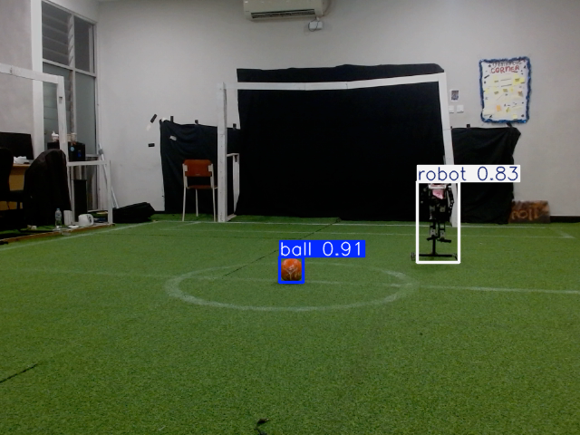
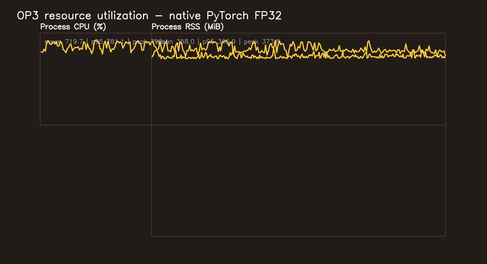
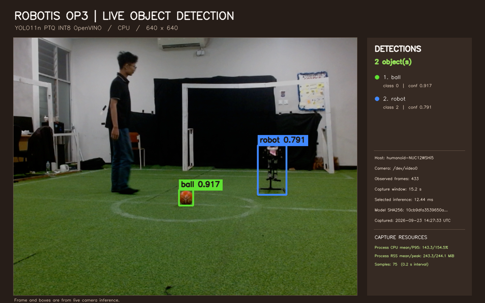
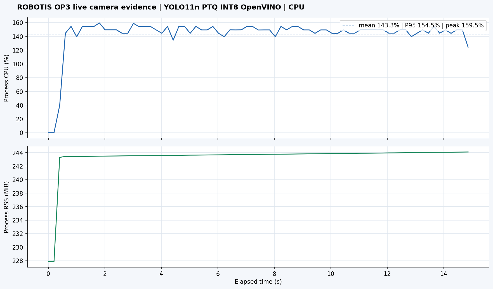

# OP3 Hardware Test Report

Updated 2026-09-23 with additional native PyTorch FP32 and existing PTQ INT8 runs. All measurements below are actual runs on the currently connected OP3 host. The host identity differs from the thesis target NUC11, so these results must be identified as NUC12 measurements.

## 1. Hardware

The connected host is `humanoid-NUC12WSHi5`, with a 12th Gen Intel Core i5-1240P (12 cores, 16 logical CPUs), 7.33 GiB RAM, Ubuntu 24.04.5 LTS, and kernel 7.0.0-31-generic. CPU features include AVX, AVX2, and AVX-VNNI; AVX-512 is unavailable. The thesis target is Intel NUC11PAHi5, so this run does not establish NUC11 performance.

The Logitech HD Pro Webcam C920 is `/dev/video0` (640 x 480, YUYV); `/dev/video1` is the second enumerated interface and was not selected. Camera observations have no ground truth.

## 2. Software

| Component | Observed |
| --- | --- |
| ROS 2 | Jazzy; workspace camera and detector launch succeeded |
| OpenVINO | 2026.3.1; CPU device compiled and inferred successfully |
| Native inference | Python 3.12.3, PyTorch 2.4.1+cpu, torchvision 0.19.1+cpu, Ultralytics 8.4.130 |
| Native inference support | NumPy 1.26.4, OpenCV 4.6.0, psutil; no OpenVINO in the native PyTorch run |
| Camera | C920 `/dev/video0`, V4L2/OpenCV and ROS `usb_cam` |
| Input / batch | 640 x 640 model input, batch 1, CPU only |

The repository's main project metadata pins Python below 3.12 and OpenVINO 2024.4. The connected ROS runtime is Python 3.12.3 / OpenVINO 2026.3.1. The native PyTorch CPU packages were installed into the ignored `.cache/hardware_models/pytorch_venv`; the system NumPy/OpenCV/psutil packages were reused. No system package or model training was changed. No NVIDIA device was used.

## 3. Model provenance

The class map in every audited model is `0: ball`, `1: gawang`, `2: robot`.

| Model | Artifact and SHA256 | Provenance / disposition |
| --- | --- | --- |
| YOLO11n FP32 native PyTorch | `artifacts/checkpoints/fp32/best.pt`, 5,481,875 bytes; `e05b2b21f7faa68f65671f0aaae37ad962aa5e25c6b8b26853fd0b389d420b8c` | Frozen checkpoint; LFS OID, completed manifest, class map, and export provenance agree. Loaded directly with Ultralytics on CPU; no OpenVINO conversion in this run. |
| YOLO11n FP32 OpenVINO | XML `233bb872e218ab3bf525188b0e105eea9f2a79e60ffecb4b767e63939ba257e7`; BIN `e85f45438b5f7c8858b1a168a03f61b12a73b8159391529d19b84e09ff854026` | Previously audited export of the frozen FP32 checkpoint; valid comparator. |
| YOLO11n PTQ INT8 OpenVINO | XML `10cb9dfa3539650a0bc46d60ad708f9ff79fc1e2dc79c5ac4a73ff4943326657`; BIN `82246726edcd780685657f673caa2b40719a8c22b67e3702ca3d1f226b8fcf81` | Existing artifact only. Manifest records `quantize=8` with a calibration dataset, no QAT checkpoint/training, and no TEST split. XML/BIN hash and size match the manifest and the repository labels it `VALID comparator`. No new PTQ export or calibration was performed for these hardware runs. |
| YOLO11n true QAT OpenVINO INT8 | Historical `artifacts/openvino/qat_int8/` candidate | **BLOCKED: no validated QAT OpenVINO artifact.** True-QAT checkpoint provenance exists, but selection acceptance and numerical-equivalence evidence do not. This candidate was not loaded or benchmarked. |

Full gates and hashes are recorded in `model_inventory.json`. The benchmark scripts refuse a QAT run unless the selection and accepted equivalence gates pass.

## 4. Experimental setup

Standalone synthetic tests used 30 warmups and 300 measured iterations. Each direct-camera run used 30 warmups and a 60-second timed window. ROS 2 comparator runs used 30 warmup callbacks and a 60-second window. Resource samples were taken approximately every 0.2 seconds. Model load, OpenVINO compile, warmups, and evidence rendering are excluded from timed measurements. Camera dropped frames are not directly countable through the selected V4L2/OpenCV interface; ROS drop counts are estimates from configured 30 FPS.

Process CPU is aggregate across cores: 100% means one logical core, so values above 100% represent multicore use. Raw per-iteration and resource CSVs are retained. The additional runs were measured at repository HEAD `33b0b3b5ac395497e111bccdbec1d4eef0c5346e` with the benchmark additions present as uncommitted source at measurement time; source scripts and their measurement-time SHA256 values are identified in the JSON outputs. The source changes are included in the final commit.

## 5. Standalone synthetic benchmark

| Model | Mean inference / P95 (ms) | Mean pipeline / loop (ms) | Inference FPS | Effective FPS | Process CPU mean / P95 | RSS mean / peak (MiB) |
| --- | ---: | ---: | ---: | ---: | ---: | ---: |
| FP32 OpenVINO | 28.491 / 30.350 | 30.504 | 35.10 | 32.77 | 873.5% / 901.3% | 227.5 / 227.6 |
| FP32 native PyTorch (no OpenVINO) | 49.484 / 53.527 | 51.651 | 20.21 | 19.35 | 800.2% / 804.8% | 360.6 / 377.2 |
| Existing PTQ INT8 OpenVINO | 11.276 / 11.616 | 13.041 | 88.69 | 76.60 | 340.4% / 343.8% | 215.9 / 216.0 |

The pipeline column is mean measured loop wall time for each engine. OpenVINO stage sums are also retained in each JSON file; they differ from loop wall time by small host/script overhead. FPS is computed from 300 completed iterations and is kept separate from the inverse mean inference latency. Outputs were finite and all three class IDs were checked against the expected mapping. Raw measurements: `benchmark_fp32.csv`, `benchmark_fp32_pytorch.csv`, and `benchmark_ptq_int8.csv`; resource CSVs use the corresponding `resources_*.csv` names.

## 6. Camera benchmark

| Model | Frames / duration | Mean inference / P95 (ms) | Mean pipeline wall (ms) | Inference FPS | Effective FPS | Process CPU mean / P95 | RSS mean / peak (MiB) |
| --- | ---: | ---: | ---: | ---: | ---: | ---: | ---: |
| FP32 OpenVINO | 1,273 / 60.04 s | 37.067 / 60.078 | 47.145 | 26.98 | 21.20 | 716.2% / 818.2% | 229.1 / 229.8 |
| FP32 native PyTorch (no OpenVINO) | 1,195 / 60.01 s | 39.502 / 44.674 | 50.179 | 25.32 | 19.91 | 719.7% / 781.1% | 358.0 / 373.6 |
| Existing PTQ INT8 OpenVINO | 1,442 / 60.01 s | 12.377 / 15.076 | 41.597 | 80.79 | 24.03 | 128.4% / 154.2% | 217.8 / 218.5 |

The direct-camera FPS is completed frames divided by the actual timed window. The V4L2 path has no source sequence counter, so dropped frames are unknown. Live detections are functional observations only and are not precision/recall measurements.

## 7. ROS 2 benchmark

The existing Jazzy `usb_cam` + `yolo11_openvino_node` launch was run with debug image publication disabled, CPU device, and the same C920. Both valid OpenVINO artifacts loaded; the node logged `/image_raw` input and `/vision/detections` output. The benchmark subscriber records `/vision/benchmark` callback messages.

| Model | Frames / duration | Mean inference / P95 (ms) | Callback latency mean / P95 (ms) | Effective FPS | Process CPU mean / P95 | RSS mean / peak (MiB) | Exceptions |
| --- | ---: | ---: | ---: | ---: | ---: | ---: | ---: |
| FP32 OpenVINO | 1,454 / 60.03 s | 31.234 / 54.827 | 33.828 / 59.505 | 24.22 | 705.1% / 863.9% | 262.2 / 262.2 | 0 |
| Existing PTQ INT8 OpenVINO | 776 / 60.01 s | 11.865 / 12.971 | 16.718 / 19.823 | 12.93 | 75.4% / 158.8% | 241.5 / 249.1 | 0 |

The PTQ callback run observed an estimated 1,024 fewer callbacks than `30 FPS x 60 s`; that figure is an estimate, not camera-side ground truth. Image timestamps had a 36.0 ms median gap and a 77.2 ms mean gap, with a 236 ms P95 gap. Therefore the PTQ ROS throughput is reported as observed and should not be inferred from the 11.9 ms model inference time alone. The camera-to-node path and DDS scheduling limited completed callbacks in this run. Native PyTorch was benchmarked standalone with the live camera; the existing ROS detector node accepts OpenVINO IR, so no native PyTorch ROS node was added.

## 8. CPU utilization

CPU was sampled throughout each run, not read once. The synthetic native PyTorch benchmark averaged 800.2% process CPU and the PTQ OpenVINO benchmark averaged 340.4%; camera runs averaged 719.7% and 128.4% respectively. ROS PTQ averaged 75.4% process CPU. System CPU and per-core samples are retained in the corresponding resource CSVs and JSON summaries. Values can vary with the active robot ROS processes and host power state.

## 9. RAM utilization

Peak process RSS was 377.2 MiB for native PyTorch synthetic inference, 373.6 MiB for its camera run, and 249.1 MiB for PTQ INT8 in the ROS node. Corresponding means and full sample distributions appear in benchmark JSON and raw resource CSVs. These are process RSS measurements; live camera observations are not model accuracy results.

## 10. Stability

The previously completed 10-minute C920 + ROS 2 stability test applies to FP32 OpenVINO only: 600.03 seconds, 14,455 processed frames, 24.09 effective FPS, zero recorded exceptions, peak RSS 262.4 MiB, and RSS growth of 28,672 bytes (0.0104%). Peak sampled thermal zone was 76 °C, below the runner's 90 °C abort threshold. No 10-minute stability claim is made for native PyTorch or PTQ; their camera runs were 60 seconds.

## 11. Limitations

- Hardware measurements are from NUC12WSHi5 / i5-1240P, not the specified NUC11PAHi5.
- The runtime differs from repository pins: Python 3.12.3 and OpenVINO 2026.3.1 were used on this host.
- The PTQ artifact is a valid existing comparator, not QAT. PTQ TEST accuracy is unavailable; existing dataset results are VAL diagnostics only.
- Live camera images have no ground truth. Camera detection count/confidence is not P, R, F1, or mAP.
- Direct V4L2 camera dropped frames are unknown. ROS camera dropped-frame counts are estimates from the configured 30 FPS and callback count.
- ROS 2 testing measured the existing OpenVINO node. Native PyTorch was tested using standalone live-camera inference, not a ROS PyTorch node.
- Only FP32 OpenVINO has a completed 10-minute stability run.
- QAT OpenVINO remains blocked pending accepted checkpoint-selection and numerical-equivalence evidence.

## 12. Final results

Dataset accuracy and OP3 hardware performance are reported separately. Existing results from the same VAL split:

| Evaluated model | Split | Precision | Recall | F1 | mAP@0.5 | mAP@0.5:0.95 | Source |
| --- | --- | ---: | ---: | ---: | ---: | ---: | --- |
| FP32 OpenVINO comparator | VAL | 0.93622 | 0.95756 | 0.94677 | 0.97297 | 0.77134 | `experiments/ptq/fp32_openvino_val_metrics.json` |
| Existing PTQ INT8 OpenVINO comparator | VAL | 0.93412 | 0.95021 | 0.94209 | 0.97215 | 0.76718 | `experiments/ptq/ptq_val_metrics.json` |

Existing held-out TEST results, kept separate from VAL diagnostics:

| Model checkpoint | Split | Precision | Recall | F1 | mAP@0.5 | mAP@0.5:0.95 | Source |
| --- | --- | ---: | ---: | ---: | ---: | ---: | --- |
| FP32 PyTorch checkpoint | TEST | 0.93135 | 0.95057 | 0.94086 | 0.96423 | 0.77991 | `experiments/final_test/fp32_test_metrics.json` |
| True QAT native PyTorch checkpoint | TEST | 0.85415 | 0.93752 | 0.89390 | 0.95119 | 0.65670 | `experiments/final_test/qat_test_metrics.json` |

The PTQ INT8 hardware rows do not inherit TEST accuracy from FP32 or QAT. The valid PTQ result is the existing VAL comparator above. There is no accepted QAT OpenVINO hardware row.

| Hardware model | Context | Inference mean / P95 (ms) | Effective FPS | Process CPU mean | RSS peak |
| --- | --- | ---: | ---: | ---: | ---: |
| FP32 OpenVINO | Synthetic | 28.491 / 30.350 | 32.77 | 873.5% | 227.6 MiB |
| FP32 native PyTorch | Synthetic | 49.484 / 53.527 | 19.35 | 800.2% | 377.2 MiB |
| PTQ INT8 OpenVINO | Synthetic | 11.276 / 11.616 | 76.60 | 340.4% | 216.0 MiB |
| FP32 OpenVINO | C920 direct | 37.067 / 60.078 | 21.20 | 716.2% | 229.8 MiB |
| FP32 native PyTorch | C920 direct | 39.502 / 44.674 | 19.91 | 719.7% | 373.6 MiB |
| PTQ INT8 OpenVINO | C920 direct | 12.377 / 15.076 | 24.03 | 128.4% | 218.5 MiB |
| FP32 OpenVINO | C920 ROS 2 | 31.234 / 54.827 | 24.22 | 705.1% | 262.2 MiB |
| PTQ INT8 OpenVINO | C920 ROS 2 | 11.865 / 12.971 | 12.93 | 75.4% | 249.1 MiB |

QAT OpenVINO latency, FPS, CPU, and RAM are intentionally absent because its deployment export has not passed validation.

## 13. Reproduction commands

Run from the thesis repository root. The FP32 checkpoint is tracked through Git LFS; download its exact object into the ignored runtime cache and verify the frozen SHA before inference:

```bash
mkdir -p .cache/hardware_models/fp32_pytorch
curl -fL https://media.githubusercontent.com/media/rafli5131/skripsi-yolo11-op3/main/artifacts/checkpoints/fp32/best.pt -o .cache/hardware_models/fp32_pytorch/best.pt
sha256sum .cache/hardware_models/fp32_pytorch/best.pt
```

The SHA must equal `e05b2b21f7faa68f65671f0aaae37ad962aa5e25c6b8b26853fd0b389d420b8c`. Create/use a CPU PyTorch runtime; the tested environment used Torch 2.4.1+cpu, torchvision 0.19.1+cpu, and Ultralytics 8.4.130:

```bash
python3 -m venv --system-site-packages .cache/hardware_models/pytorch_venv
.cache/hardware_models/pytorch_venv/bin/python -m pip install --no-deps --index-url https://download.pytorch.org/whl/cpu 'torch==2.4.1+cpu' 'torchvision==0.19.1+cpu'
.cache/hardware_models/pytorch_venv/bin/python -m pip install --no-deps 'ultralytics==8.4.130' 'filelock>=3.12'
.cache/hardware_models/pytorch_venv/bin/python scripts/benchmark_op3_pytorch.py --mode synthetic --device cpu --warmup 30 --iterations 300
.cache/hardware_models/pytorch_venv/bin/python scripts/benchmark_op3_pytorch.py --mode camera --seconds 60 --camera-device /dev/video0 --device cpu --warmup 30
```

For OpenVINO, use the installed ROS virtual environment and the repository's existing model artifacts:

```bash
source /opt/ros/jazzy/setup.bash
source /home/humanoid/ros2_jazzy/install/setup.bash
source /home/humanoid/ros2_jazzy/.venv-op3-vision/bin/activate
python scripts/benchmark_op3.py --model-kind fp32 --model-xml .cache/hardware_models/fp32/model.xml --device CPU --warmup 30 --iterations 300
python scripts/benchmark_op3.py --mode camera --seconds 60 --camera-device /dev/video0 --model-kind fp32 --model-xml .cache/hardware_models/fp32/model.xml --device CPU --warmup 30
python scripts/benchmark_op3.py --model-kind ptq_int8 --device CPU --warmup 30 --iterations 300
python scripts/benchmark_op3.py --mode camera --seconds 60 --camera-device /dev/video0 --model-kind ptq_int8 --device CPU --warmup 30 --result-stem camera_benchmark_ptq_int8
```

The PTQ ROS 2 run used the existing launch and comparator path:

```bash
ros2 launch op3_advanced_detector yolo11_openvino_camera.launch.py model_path:=/home/humanoid/ros2_jazzy/skripsi-yolo11-op3/experiments/ptq/backend_models/ptq_openvino_model/model.xml video_device:=/dev/video0 input_topic:=/image_raw python_prefix:=/home/humanoid/ros2_jazzy/.venv-op3-vision/bin/python publish_debug_image:=false
python scripts/benchmark_op3_ros2.py --model-kind ptq_int8 --model-xml experiments/ptq/backend_models/ptq_openvino_model/model.xml --seconds 60 --warmup 30 --camera-fps 30 --result-stem ros2_benchmark_ptq_int8
```

For FP32 OpenVINO ROS 2 and stability reproduction, use the same launch arguments with `.cache/hardware_models/fp32/model.xml`, then run:

```bash
python scripts/benchmark_op3_ros2.py --model-kind fp32 --model-xml .cache/hardware_models/fp32/model.xml --seconds 60 --warmup 30 --camera-fps 30 --result-stem ros2_benchmark
python scripts/benchmark_op3_ros2.py --model-kind fp32 --model-xml .cache/hardware_models/fp32/model.xml --seconds 600 --warmup 30 --camera-fps 30 --result-stem stability_test
```

Evidence and provenance commands:

```bash
python scripts/capture_op3_evidence.py --model-kind ptq_int8 --camera-device /dev/video0 --capture-seconds 15
python scripts/audit_hardware_op3.py
python scripts/audit_op3_models.py
```

The QAT runner remains intentionally blocked until accepted QAT selection and numerical-equivalence evidence are present.

## 14. Visual evidence

The two new detection cards below are selected real C920 frames. The images show predicted class and confidence; their adjacent resource cards are rendered from the actual sampled CPU/RAM rows. Neither image is a dataset accuracy evaluation.









The previously recorded FP32 OpenVINO image and the 10-minute ROS 2 resource plot remain available as `evidence/live_detection_evidence.png` and `evidence/resource_utilization_10min.png`.
